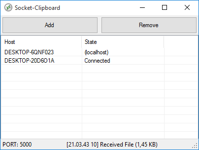

# Socket-Clipboard
LAN-wide clipboard syncronization tool using .NET socket

[Download Binary](Info/SocketCopy.exe)

## Introduction

This software is made for those who often run multiple computer (windows) on their desk.

The software syncronize clipboard buffer between computer using TCP/Net Socket. The software run both as a Client and Server at a time.

In order to make it work you need to make your computers run in the same network and all running the same version of this software, then list every client in every computer so each can send packets each other seamlessly.

For security reason in first run you need to list the clients manually in each computer. All client name is determined by its computer name. The list then saved for the next session.

## Capabilities

As soon as you hit Ctrl+C the clipboard packet is sent to clients you listed. Then each client will receive the packet then update its clipboard buffer. This way all computer will have the same clipboard data.

Supported packets are: Text, RTF, HTML, CSV, Image, File(s). Multiple files with directories are accepted and instantly sent to all clients. File size limit can be applied individually via options in tray icon.

All computer clients must be in the same port number. You can use different port number for different clipboard packet layer. Port number can be changed by clicking the port number in status bar.

There is a notification icon for quick hint of send/receive activities. You can click that to hide or show the main UI.

## Limitation

File size per packet is default limited to 50 MB in order to prevent in case of accidentally send big files over all computer. File size limit can be overriden via options in context menu.

When building the software please set the attention to Debug/Release profile because optimized code is different than debuggable code so both can't talk each other.

When a file is send, all client save the file in %temp% folder, and it's not cleaned up automatically. Consider to clean up that temporarty folder occasionally.

If a connection didn't work please check if all clients: has firewall grant, on the same network, on the same port.

## License

Distrubuted under [MIT License](LICENSE).