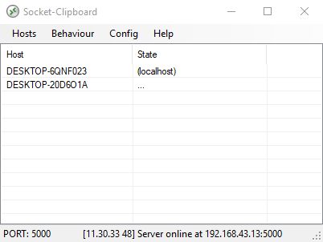
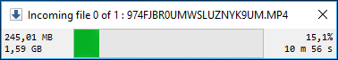

# Socket-Clipboard
LAN-wide clipboard syncronization tool using .NET socket

[Download Binary at Release](https://github.com/willnode/Socket-Clipboard/releases)

## Introduction

The software is made for those who often run multiple computer (windows) on their desk.

The software syncronize clipboard buffer between computer using TCP/Net Socket. The software run both as a Client and Server at any time.

In order to make it work you need to make your computers run in the same network and all running the same version of this software, then list every client in every computer so each can send packets each other seamlessly.

Each client is recognized by their hostname (which is equivalent to its computer name). You can add or remove clients using Hosts menu bar. When you add a client, it's mean that client are able to receive your clipboard data.

## Capabilities

As soon as you hit Ctrl+C the clipboard packet is sent to clients you listed. Then each client will receive the packet then update its clipboard buffer. This way all computer will have the same clipboard data.

You can transfer strings, images, and files. Multiple files with directories are accepted and instantly sent to all clients. 

All computer clients must be in the same port number. You can use different port number for different clipboard packet layer. Port number can be changed by clicking the port number in status bar.

There is a notification icon for quick hint of send/receive activities. You can click that to hide or show the main UI.

## Limitation

As of v1.2 you can transfer big files without any problem. However note that currently there are no way to abort a transfer except killing the software instead.

When a file is send, all client save the file in %temp% folder, and it's not cleaned up automatically. Consider to clean up that temporarty folder occasionally.

If a connection didn't work please check if all clients: has firewall grant, on the same network, on the same port, and running socket-clipboard with the same version.

## License

Distrubuted under [MIT License](LICENSE).